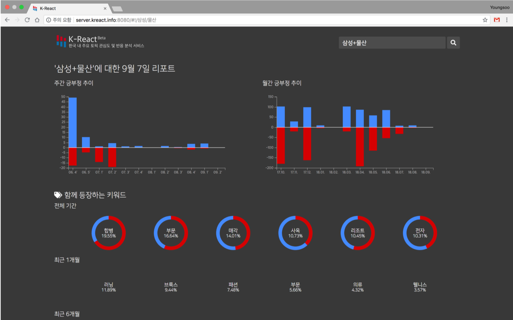

# K-React: Korea Reaction Anaysis Service from Internet News



Graduation Project on Hanyang University Computer Science Department, B.S.
with [Taehwa Jung](https://github.com/thjeong917) (2018)


## How to run

**Prerequisite**

[Docker Engine](https://docs.docker.com/install/) and [docker-compose](https://docs.docker.com/compose/install/) needed to be installed.


**Step 1: Clone this repo**

```bash
$ git clone https://github.com/Prev/kreact
```


**Step 2: Download pre-trained data and unzip it**

```bash
$ cd redis-data
$ curl https://s3.ap-northeast-2.amazonaws.com/prev-gets/permanent/appendonly.aof.gz
$ gzip -d appendonly.aof.gz
```

> Notice: Pre-trained data is generated in Oct 2018, which means there are NO RECENT DATA


**Step 3: Run Docker**

```bash
$ docker-compose up
```


