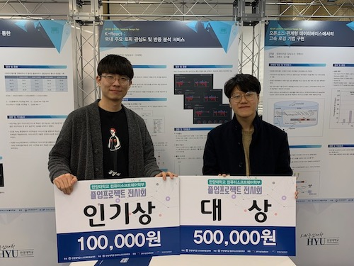

# K-React: Korea Reaction Anaysis Service from Internet News


Graduation Project on Hanyang University Computer Science Department, B.S.
with [Taehwa Jung](https://github.com/thjeong917) (2018)


## How to run

**Prerequisite**

[Docker Engine](https://docs.docker.com/install/) and [docker-compose](https://docs.docker.com/compose/install/) needed to be installed.


**Step 1: Clone this repo**

```bash
$ git clone https://github.com/Prev/kreact
```


**Step 2: Download pre-trained data and unzip it**

> Notice: Pre-trained file is **375MB**

```bash
$ cd redis-data
$ curl -O https://s3.ap-northeast-2.amazonaws.com/prev-gets/permanent/appendonly.aof.gz
$ gzip -d appendonly.aof.gz
```

> Notice: Pre-trained data is generated in Oct 2018, which means there are NO RECENT DATA


**Step 3: Run Docker**

```bash
$ cd ..
$ docker-compose up
```


**Access to app**

Then you can access app on [http://localhost:8080](http://localhost:8080) (You can change port on `docker-compose.yml`).

> It takes time to load data from file to memory on `redis`, so you might wait for some time.)


## Use cases

Get public opinion of policies goverment excuting, or analyze postivie & negative point(keywords) of the company.

Blue means positive, and red means negative in both bar-chart and donut graph. Querying multiple keywords is available, analyzing common articles and reactions of the keywords.

**BTS**


**North Korea & Trump**


**Economy Policies**


## Appendix

Got 1st award and award of popularity(by public voting) on Graduation Project Exhibition, Hanyang University Computer Science Department, Nov 2018.



